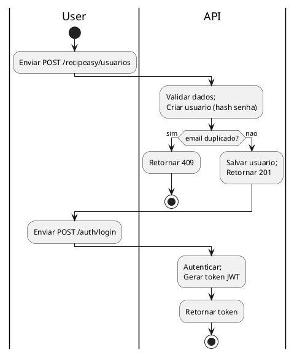
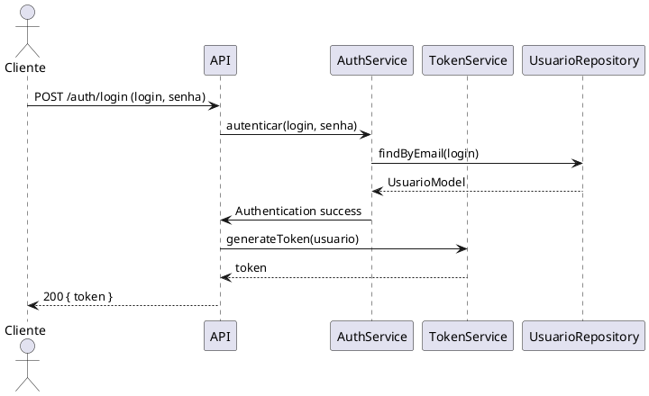

# Arquitetura — Recipeasy API

**Autor:** Thiago Cavalcanti

**Data de atualização:** 2026-02-26


---

>**Descrição:** A arquitetura do projeto Recipeasy API. Contém: visão geral do fluxo, C4 model (PlantUML), BPMN, diagrama de sequência, estrutura do banco de dados, mapeamento de rotas.

---

## Tecnologias 

- Java 21
- Spring
- PostgreSQL
- Auth: JWT 
- Build: Maven
- Documentação: OpenAPI / Swagger
---

## Visão geral do fluxo (simplificado)

1. Usuário se registra: POST /recipeasy/usuarios (criação de usuário)
2. Usuário faz login: POST /auth/login → AuthenticationManager valida credenciais (UserDetailsService/AuthorizationService) → TokenService gera JWT
3. Cliente usa o token (Authorization: Bearer <token>) para acessar rotas protegidas
4. SecurityFilter recupera token de Authorization header, valida via TokenService, extrai subject (email), busca usuário no banco, e monta Authentication no SecurityContext
5. Recursos protegidos (por ex. GET /recipeasy/usuarios) validam roles (hasRole("ADMIN") etc)

> Nota: Para desenvolvimento existe um endpoint auxiliar (perfil `dev`) para gerar um token admin: GET /auth/dev-token — somente quando o profile `dev` está ativo.

---

## Mapeamento de rotas (rotas atuais no código)

- AuthController
  - POST /auth/login — login com email e senha (returns token)
- DevAuthController (apenas quando profile `dev` ativo)
  - GET /auth/dev-token — geração de token ADMIN (apenas dev)
- UsuarioController
  - GET /recipeasy/usuarios — listar todos (ROLE_ADMIN requerido)
  - GET /recipeasy/usuarios/{id} — obter por id (autenticado)
  - POST /recipeasy/usuarios — criar usuário (permitAll)
  - PUT /recipeasy/usuarios/{id} — atualizar usuário (autenticado)
  - DELETE /recipeasy/usuarios/{id} — deletar usuário (autenticado)

- Nota: `ReceitaController` e `RefeicaoController` no código-fonte atual estão vazios (sem endpoints). Serviços para receita/refeicao existem (save/delete) mas não há controllers expostos atualmente.

---

## Segurança (resumo)

- JWT no header Authorization: Bearer <token>
- `SecurityFilter` valida token e popula `SecurityContext`
- `SecurityConfig` define regras:
  - /auth/** permitAll
  - POST /recipeasy/usuarios permitAll (registro)
  - GET /recipeasy/usuarios requires ROLE_ADMIN
  - /recipeasy/usuarios/** authenticated

---

## OpenAPI (YAML) — Spec mínima para SwaggerHub

Este bloco YAML pode ser importado em SwaggerHub ou usado com springdoc-openapi. Ele mapeia as rotas existentes e descreve segurança bearer.

```yaml
openapi: 3.0.3
info:
  title: Recipeasy API
  version: 0.1.0
  description: API para gerenciamento de usuários, receitas e refeicoes (documentacao gerada por Thiago Cavalcanti)
servers:
  - url: http://localhost:8080
security:
  - bearerAuth: []
components:
  securitySchemes:
    bearerAuth:
      type: http
      scheme: bearer
      bearerFormat: JWT
  schemas:
    AuthRequest:
      type: object
      properties:
        login:
          type: string
        senha:
          type: string
      required: [login, senha]
    LoginResponse:
      type: object
      properties:
        token:
          type: string
    UsuarioRequest:
      type: object
      properties:
        nome:
          type: string
        email:
          type: string
        senha:
          type: string
        role:
          type: string
      required: [nome, email, senha, role]
    UsuarioResponse:
      type: object
      properties:
        id:
          type: string
          format: uuid
        nome:
          type: string
        email:
          type: string
        role:
          type: string
        dataCriacao:
          type: string
          format: date-time
paths:
  /auth/login:
    post:
      summary: Login
      tags: [Auth]
      requestBody:
        required: true
        content:
          application/json:
            schema:
              $ref: '#/components/schemas/AuthRequest'
      responses:
        '200':
          description: Token JWT
          content:
            application/json:
              schema:
                $ref: '#/components/schemas/LoginResponse'
  /auth/dev-token:
    get:
      summary: Gera token ADMIN para desenvolvimento
      description: Disponivel apenas quando o profile `dev` esta ativo
      tags: [Auth]
      responses:
        '200':
          description: Token JWT de desenvolvimento
          content:
            application/json:
              schema:
                $ref: '#/components/schemas/LoginResponse'
  /recipeasy/usuarios:
    get:
      summary: Lista usuarios
      security:
        - bearerAuth: []
      responses:
        '200':
          description: Lista de usuarios
          content:
            application/json:
              schema:
                type: array
                items:
                  $ref: '#/components/schemas/UsuarioResponse'
    post:
      summary: Cria usuario
      requestBody:
        required: true
        content:
          application/json:
            schema:
              $ref: '#/components/schemas/UsuarioRequest'
      responses:
        '201':
          description: Usuario criado
          content:
            application/json:
              schema:
                $ref: '#/components/schemas/UsuarioResponse'
  /recipeasy/usuarios/{id}:
    get:
      summary: Obtem usuario por id
      parameters:
        - in: path
          name: id
          required: true
          schema:
            type: string
            format: uuid
      security:
        - bearerAuth: []
      responses:
        '200':
          description: Usuario
          content:
            application/json:
              schema:
                $ref: '#/components/schemas/UsuarioResponse'
    put:
      summary: Atualiza usuario
      parameters:
        - in: path
          name: id
          required: true
          schema:
            type: string
            format: uuid
      requestBody:
        required: true
        content:
          application/json:
            schema:
              $ref: '#/components/schemas/UsuarioRequest'
      security:
        - bearerAuth: []
      responses:
        '200':
          description: Usuario atualizado
          content:
            application/json:
              schema:
                $ref: '#/components/schemas/UsuarioResponse'
    delete:
      summary: Remove usuario
      parameters:
        - in: path
          name: id
          required: true
          schema:
            type: string
            format: uuid
      security:
        - bearerAuth: []
      responses:
        '204':
          description: Removido
```

---

## Sugestão: integrar com Swagger / Springdoc

- Dependência Maven recomendada:

```xml
<!-- springdoc-openapi -->
<dependency>
  <groupId>org.springdoc</groupId>
  <artifactId>springdoc-openapi-starter-webmvc-ui</artifactId>
  <version>2.1.0</version>
</dependency>
```

- Com `springdoc` em uso, o OpenAPI estará disponível em `/v3/api-docs` e a UI em `/swagger-ui.html`.

- Para documentar controllers no código (opcional), adicione anotações `@Operation` e `@Tag` (io.swagger.v3.oas.annotations):

```java
@Tag(name = "Auth")
@RestController
@RequestMapping("/auth")
public class AuthController {

    @Operation(summary = "Login")
    @PostMapping("/login")
    public ResponseEntity<LoginResponseDTO> login(@RequestBody @Valid AuthModel data) { ... }
}
```

> Para enviar o spec para o SwaggerHub, exporte o YAML acima (ou `http://localhost:8080/v3/api-docs.yaml`) e importe no SwaggerHub.

---

## C4 Model (PlantUML)

Insira o bloco PlantUML em um renderer (PlantUML, https://plantuml.com):

```plantuml
@startuml C4_Context
!include https://raw.githubusercontent.com/plantuml-stdlib/C4-PlantUML/master/C4_Context.puml
Person(user, "Usuário", "Usuário da aplicação")
System(api, "Recipeasy API", "Spring Boot REST API")
SystemDb(db, "PostgreSQL", "Banco de dados relacional")
Rel(user, api, "Usa via HTTP/HTTPS (REST)")
Rel(api, db, "Leitura/Escrita (JPA)")
@enduml
```

Container (exemplo):

```plantuml
@startuml C4_Container
!include https://raw.githubusercontent.com/plantuml-stdlib/C4-PlantUML/master/C4_Container.puml
Person(user, "Usuário")
System_Boundary(api, "Recipeasy API") {
  Container(web, "API REST", "Spring Boot", "Expõe as rotas REST")
  ContainerDb(db, "Database", "PostgreSQL", "Persistência")
}
Rel(user, web, "HTTP/JSON")
Rel(web, db, "JDBC/JPA")
@enduml
```

Component level (exemplo):

```plantuml
@startuml C4_Component
!include https://raw.githubusercontent.com/plantuml-stdlib/C4-PlantUML/master/C4_Component.puml
Container(web, "API REST")
Component(auth, "AuthController")
Component(usuario, "UsuarioController")
Component(tokenSvc, "TokenService")
Rel(web, auth, "exposes")
Rel(web, usuario, "exposes")
Rel(auth, tokenSvc, "uses")
@enduml
```

---

## BPMN (fluxo de registro/login) — PlantUML



---

## Diagrama de Sequência (login)



---

## Estrutura do banco de dados (tabelas principais)

Banco: PostgreSQL

DDL (exemplo simplificado):

```sql
-- Usuario
CREATE TABLE usuarios (
  id UUID PRIMARY KEY DEFAULT gen_random_uuid(),
  nome VARCHAR(255) NOT NULL,
  email VARCHAR(255) NOT NULL UNIQUE,
  senha VARCHAR(255) NOT NULL,
  role VARCHAR(50) NOT NULL,
  data_criacao TIMESTAMP WITHOUT TIME ZONE NOT NULL DEFAULT now()
);

-- Receita
CREATE TABLE receitas (
  id UUID PRIMARY KEY DEFAULT gen_random_uuid(),
  nome VARCHAR(255) NOT NULL,
  descricao TEXT,
  instrucoes TEXT,
  tempo_preparo INTERVAL,
  usuario_id UUID NOT NULL REFERENCES usuarios(id)
);

-- Refeicao
CREATE TABLE refeicoes (
  id UUID PRIMARY KEY DEFAULT gen_random_uuid(),
  tipo VARCHAR(255),
  data DATE,
  usuario_id UUID NOT NULL REFERENCES usuarios(id)
);

-- Join table refeicoes_receitas
CREATE TABLE refeicoes_receitas (
  refeicao_id UUID NOT NULL REFERENCES refeicoes(id),
  receita_id UUID NOT NULL REFERENCES receitas(id),
  PRIMARY KEY (refeicao_id, receita_id)
);
```

> Observação: o projeto usa JPA/Hibernate; a configuração `spring.jpa.hibernate.ddl-auto=update` automaticamente sincroniza a estrutura básica.

---

## Observações finais e próximos passos recomendados

- Adicionar `@JsonIgnore` / `@JsonManagedReference` e `@JsonBackReference` nos relacionamentos bidirecionais para evitar loop de serialização.
- Adicionar `role` como claim no JWT para evitar consulta ao banco em cada request (trade-off entre payload e validação ao vivo).
- Remover credenciais hardcoded (usar variables de ambiente ou vault).
- Corrigir `spring-data-bom` para `dependencyManagement` (pom.xml).
- Adicionar testes unitários e de integração (especialmente para `TokenService` e `SecurityFilter`).
- Considerar paginação (Pageable) para endpoints listagem.

---

### Como usar este documento

- PlantUML blocks podem ser colados em um renderer (PlantUML, Intellij plugin, ou sites) para gerar diagramas.
- O bloco OpenAPI YAML pode ser importado em SwaggerHub ou usado com `springdoc` para gerar documentação automática.


